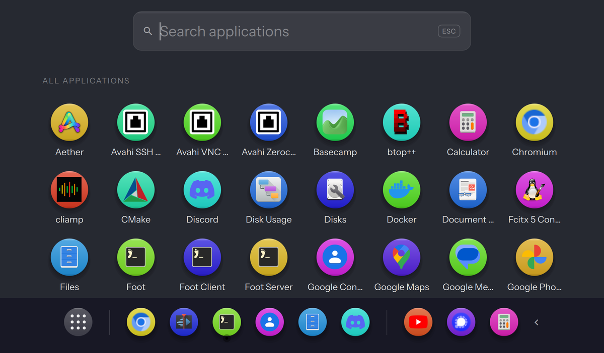

# Magnify Dock for Omarchy

A macOS-style dock for [Omarchy](https://omarchy.org): frosted capsule,
pointer magnification wave, launch bounce, drag-to-reorder, live window
previews, a built-in app drawer, and a settings card for everything.



This is a redesigned fork of
[wisangdg/omarchy-magnify-dock](https://github.com/wisangdg/omarchy-magnify-dock).
The magnification physics and window tracking come from upstream; the visual
design, the drawer, previews, and most settings are new.

## Install

```bash
omarchy plugin add https://github.com/marcho78/omarchy-magnify-dock.git --enable
```

The dock appears at the bottom of every monitor. Right-click the launcher
tile (the dotted square) for **Dock Settings**, a wide dialog with pages for
Appearance, Colors, Windows, Dock items, Behavior and Presets.

If you had `wdg.dock` installed, disable it first with
`omarchy plugin disable wdg.dock`. Both docks share the same config file,
so your pinned apps carry over.

### Keybind for the app drawer

Add this to `~/.config/hypr/bindings.lua` and run `hyprctl reload`:

```lua
o.bind("SUPER + A", "App drawer", "omarchy-shell magnify-dock drawer")
```

Pick any key you like; the command toggles the drawer through the dock's IPC.

## Using it

| Action | How |
|---|---|
| Launch or focus an app | Left-click its tile. If it has several windows, hover to pick one. |
| App drawer | Click the launcher tile, or Super+A with the binding above. Type to search, Enter launches the first match, Escape closes. |
| Pin an app | Right-click a running app and choose **Keep in Dock**, right-click a drawer tile, or drag a tile from the drawer onto the dock where you want it. |
| Reorder | Drag pinned tiles along the rail. |
| Unpin | Right-click and choose **Remove from Dock**, or middle-click a pinned tile. |
| Close a window | Middle-click a running app, use the context menu, or the × on a preview card. |
| Mute an app | Right-click and choose **Mute Audio**. |
| Folder tile | Click opens the folder, hover lists its newest entries, middle-click or right-click removes it. |
| Trash tile | Click opens the trash, right-click for Empty Trash. |
| Settings | Right-click the launcher tile. |
| Collapse the dock | Turn on **Collapse control** in settings, then click the arrow at the end of the rail. |

Web apps made with `omarchy-launch-webapp` are recognised by their site, so
they show their own icon and name while running and pin correctly.

## Settings

Everything applies live and is saved to `~/.config/omarchy/dock-pinned-macos.json`.

**Appearance**: icon size, magnification, spacing, background opacity, text
size, window preview width and height, recent apps shown.

**Icon shape**: Rounded, Circle, or Square.

**Colors**: **Follow Omarchy theme** (on by default) takes the dock, drawer
and accent colours from the current theme. Turn it off to pick your own dock,
drawer, accent, and preview-window colours with the built-in picker or a hex
value.

**Windows shown**: all windows, this monitor, or the active workspace.

**Behavior**: auto-hide, reserve space, window previews, recent apps, dock
background, collapse control.

**Dock items**: recent apps group, badges, trash tile, collapse control, and
folder tiles. Badges show the unread counts apps publish over D-Bus (the
Unity LauncherEntry interface used by Telegram, Thunderbird, Discord, Slack
and others) and a dot on windows that ask for attention. The trash tile
switches icon when the trash has contents; click opens it, right-click offers
Empty Trash. Folder tiles come from quick chips (Home, Downloads, …) or any
path; click opens the folder, hovering lists its newest entries.

**Presets**: type a name and press **Save** to snapshot the whole
configuration (every setting above, auto-hide, reserve space, and the pinned
apps). **Apply** restores a snapshot, × deletes it. Saving under an existing
name overwrites it. Presets are stored in `~/.config/omarchy/dock-presets.json`,
separate from the live config, so you can copy that file to another machine.

## IPC

```bash
omarchy-shell magnify-dock drawer     # toggle the app drawer
omarchy-shell magnify-dock settings   # toggle the settings dialog
omarchy-shell magnify-dock settingsPage presets   # open a page: appearance, colors, windows, items, behavior, presets
omarchy-shell magnify-dock autoHide   # toggle auto-hide
omarchy-shell magnify-dock status     # JSON state
omarchy-shell magnify-dock presets    # names of saved presets
omarchy-shell magnify-dock savePreset "Work"
omarchy-shell magnify-dock preset "Work"        # apply
omarchy-shell magnify-dock deletePreset "Work"
```

Applying a preset from a keybind works the same way as the drawer binding,
for example `o.bind("SUPER + SHIFT + D", "Dock: work preset", "omarchy-shell magnify-dock preset Work")`.

## Requirements

* Omarchy with omarchy-shell (Quickshell) and Hyprland.
* `wl-clipboard` for the copy actions in settings.
* Python 3 and `pactl` for the per-app mute action (upstream's `dock-audio.py`).
* Python 3 with GObject introspection (`python-gobject`, present on Omarchy)
  for badges; without it the badge relay simply stays silent.
* `gio` (GLib) for the trash tile's Empty Trash action.

The plugin makes no network requests. It bundles the Instrument Sans font
(SIL Open Font License, see `fonts/OFL.txt`).

## Notes

* The frosted look relies on translucency. Omarchy ships Hyprland with blur
  off; the dock does not change compositor settings.
* Live window previews use Hyprland's per-window capture. Turn them off in
  Behavior on machines where capture is costly.
* Clicking the launcher a second time without moving the mouse may not close
  the drawer on some setups; nudge the mouse or press Escape.

## Credits

Upstream dock by [wisangdg](https://github.com/wisangdg), MIT. Redesign,
drawer, previews and settings by [@devsec_ai](https://x.com/devsec_ai).

## License

MIT
